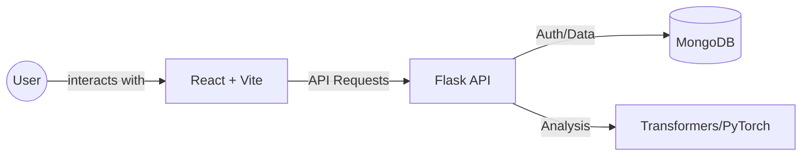

# 🧘 Mental Health Companion

An AI-powered support platform designed to provide empathy, mood tracking, and wellness tools. This project integrates a React/Vite frontend with a Flask backend, utilizing MongoDB for storage and Hugging Face Transformers for sentiment and emotion analysis.

---

## 🚀 Features

- **🧠 Smart Mood Logging**: Log your daily experiences and let AI detect underlying sentiment and emotions (Joy, Sadness, Anger, etc.).
- **💬 Empathetic AI Chatbot**: A companion that listens and adapts its responses based on your current emotional state.
- **📈 Mood Dashboard**: Visualize your emotional journey over time with interactive charts.
- **✅ Habit & Streak Tracking**: Stay consistent with your wellness goals through gamified daily task tracking.
- **🌬️ Wellness Tools**: Access guided breathing exercises and professional self-assessment tools.
- **✨ Modern UI**: A premium, responsive interface featuring glassmorphism, dark mode, and smooth animations.

---

## 🛠️ Tech Stack

### Frontend
- **Framework**: React.js (v18+)
- **Build Tool**: Vite
- **Styling**: Vanilla CSS (Glassmorphism design system)
- **Icons**: Lucide React
- **Routing**: React Router DOM

### Backend
- **Framework**: Python Flask
- **Database**: MongoDB (NoSQL)
- **Authentication**: JWT (JSON Web Tokens) & Bcrypt
- **AI/ML**: Hugging Face Transformers & PyTorch

---

## 📐 System Architecture



---

## ⚙️ Setup Instructions

### Prerequisites

   cd backend
   ```
2. Create and activate a virtual environment:
   ```cmd
   python -m venv venv
   venv\Scripts\activate
   ```
3. Install dependencies:
   ```cmd
   pip install -r requirements.txt
   ```
4. Configure `.env`:
   ```env
   SECRET_KEY=yoursecretkey
   MONGO_URI=mongodb://localhost:27017/mental_health_db
   JWT_SECRET=yourjwtsecret
   ```
5. Run the server:
   ```cmd
   python app.py
   ```
   *The API will be available at `http://localhost:5000`*

### 2. Frontend Setup
1. Navigate to the frontend directory:
   ```cmd
   cd frontend
   ```
2. Install dependencies:
   ```cmd
   npm install
   ```
3. Run the development server:
   ```cmd
   npm run dev
   ```
   *The UI will be available at `http://localhost:5173`*

---

## 🔒 Environment Variables

Ensure you have a `.env` file in the `backend/` folder with the following:
```env
SECRET_KEY=yoursecretkeyhere
MONGO_URI=mongodb://localhost:27017/mental_health_db
JWT_SECRET=yourjwtsecretkey
```

---

## 🤝 Contributing
Feel free to fork this project and submit pull requests for any features or improvements!
